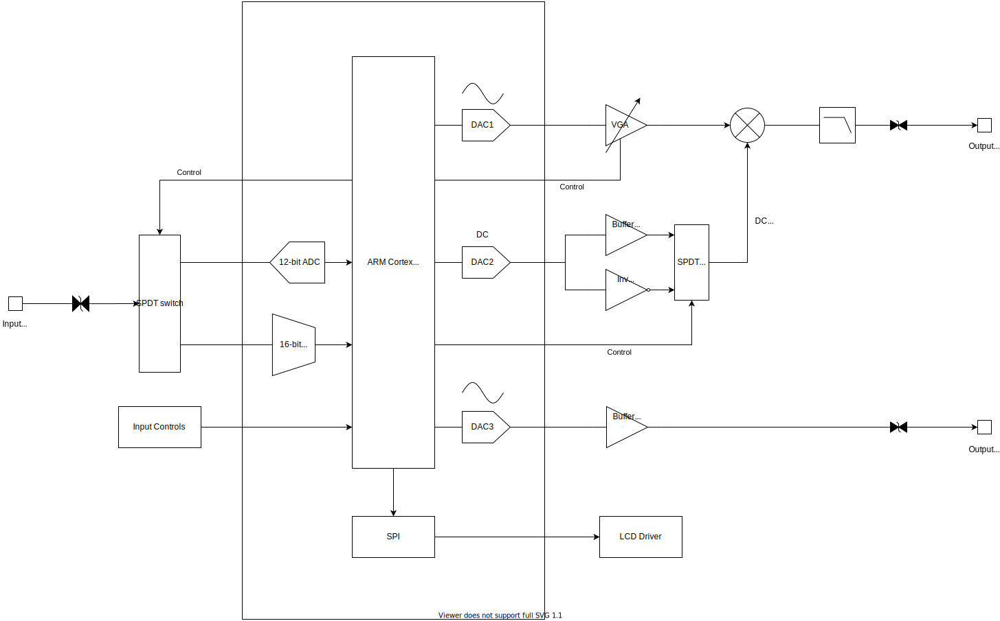
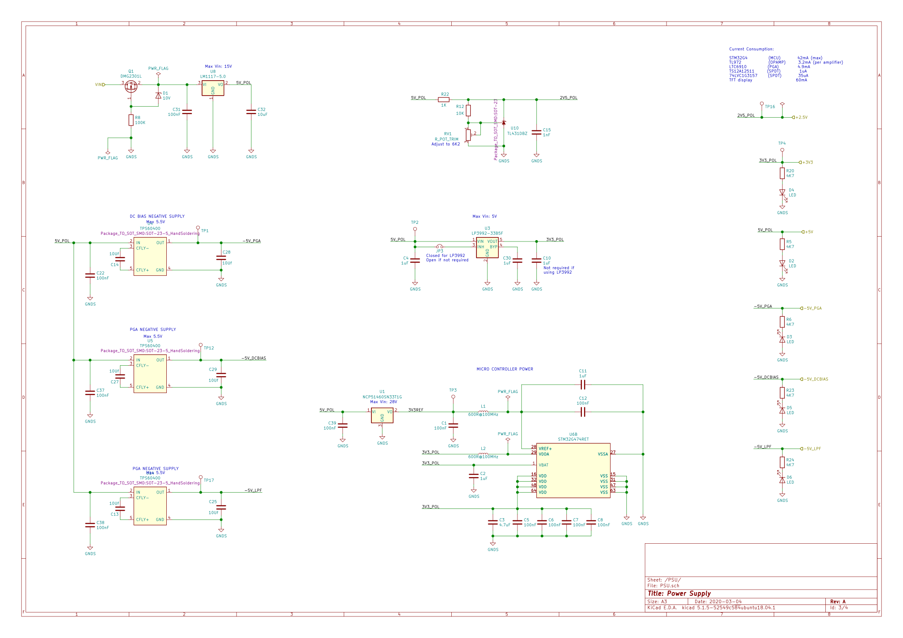

## Cortex M4-based Function Generator (Hardware)
A function generator powered by STM32 G4.

For details of the MCU configuration and firmware refer to [FunctionGeneratorCortexM4_SW](https://github.com/cracked-machine/FunctionGeneratorCortexM4_SW)

### System Overview

Input signals can be used as a trigger, capturing on voltage level or edge detection.

DAC1 synthesises the main output signal waveform and sends it to a voltage gain amplifier ([LTC6910-3](https://www.analog.com/media/en/technical-documentation/data-sheets/6910fb.pdf)). The signal is then mixed with the DC offset signal from DAC2. The signal is then passes through a lowpass filter to remove any high frequency noise.

DAC2 is a DC signal 0-3.3V. This is sent to a buffer and inverting buffer. Either output is selected using the MCU-controlled SPDT switch IC ([TS12A12511DCNR](http://www.ti.com/lit/ds/symlink/ts12a12511.pdf)). This applies a software configurable DC offset between +3.3V and -3.3V to the main output signal.

DAC3 is an output signal synchronised to DAC1 to be used for triggering purposes.

### Power supply

##### Current Consumption:

|Component|Type|Current|
|---------|----|-------|
|STM32G4|MCU|42mA (max)|
|TL972|OPAMP|3.2mA (per amplifier)|
|LTC6910-3|PGA|4.9mA|
|TS12A12511|SPDT|1uA|
|74LVC1G3157|SPDT|35uA|
|LCD TFT|display|60mA|
|*__Total__*||*__120mA__*|

The 9V input is regulated down to 3.3V and 5V for the MCU and LCD display.

Dual supply for the VGA and opamps are provided using multiple [TPS60400](http://www.ti.com/lit/ds/symlink/tps60402.pdf) charge pumps. TPS60400 are rated at 60mA output but in testing was found to be less. Therefore, multiple TPS60400 were required to provide "point-of-load" regulation.

Additional filtering is provided at the MCU supply pins with L1 and L2 ferrite beads and C1-C12 bypass capacitors.

A midpoint reference 2.5V voltage is provided to the LTC6910-3 VGA using a  [TL431DBZ](https://www.ti.com/lit/ds/symlink/tl431.pdf) precision programmable reference.

### Limitations

The power supply limits the output to 9Vp-p. The output swing of the VGA limits this further.

The VGA output current is limited to ~25mA. This is also limited by the power supply.

Due to the settling time of the VGA, smooth sweeps between output amplitude levels using this IC was not possible. As such, the output is fixed to the maximum VGA level. Output amplitude control was handled by the firmware instead.

See [LTC6910-3](https://www.analog.com/media/en/technical-documentation/data-sheets/6910fb.pdf) datasheet for more information.
